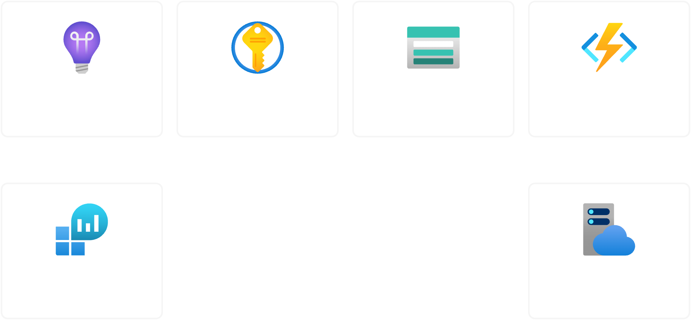

A number of the workloads i run in Azure are based around Python Function Apps, so i thought it would be a good idea to create a terraform module that can be reused across multiple projects while testing out some of the new features in terraform, [Terraform Test framework](https://developer.hashicorp.com/terraform/language/tests) & [Write only arguments](https://developer.hashicorp.com/terraform/language/resources/ephemeral/write-only) 
> [View the Module on GitHub](https://github.com/thecomalley/terraform-azurerm-python-function)

<!-- truncate -->


## Module Overview

The module deploys a Python Function App along with its source code to Azure. It creates the necessary resources such as a resource group, storage account, service plan, application insights, log analytics workspace, and key vault. The module also handles the deployment of the Python source code and sets up environment variables.



```hcl
module "terraform_azurerm_python_function" {
  source  = "thecomalley/python-function/azurerm"
  version = "1.1.0"

  location = "Australia East"

  resource_group_name       = "example-rg"
  function_app_name         = "example-func"
  storage_account_name      = "examplestorage"
  log_analytics_name        = "example-law"
  app_service_plan_name     = "example-asp"
  application_insights_name = "example-ai"
  key_vault_name            = "example-kv"

  python_version     = "3.11"
  python_source_code = "src"

  environment_variables = {
    EXAMPLE_ENV_1 = "value1"
    EXAMPLE_ENV_2 = "value2"
  }

  secret_environment_variables = [
    "SECRET_1",
    "SECRET_2",
  ]
}
```

## Function Source Code Deployment

While there are a number of ways to deploy your source code to the function app, this module leverages the Zip deploy method fully orchestrated by terraform. This is ideal for small projects or when you want to keep the source code in the same repository as your terraform code. However its worth calling out that its not always the best option especially for larger projects, where splitting the infra and source code deployment may be more appropriate. You can read more about the different deployment methods [here](https://learn.microsoft.com/en-us/azure/azure-functions/functions-deployment-technologies?tabs=windows).

### Zip Deploy 

By setting the below Application settings, we enable the zip deploy method, 

`ENABLE_ORYX_BUILD` Indicates whether the Oryx build system is used during deployment. ENABLE_ORYX_BUILD must be set to true when doing remote build deployments to Linux

`SCM_DO_BUILD_DURING_DEPLOYMENT` Controls remote build behavior during deployment. When SCM_DO_BUILD_DURING_DEPLOYMENT is set to true, the project is built remotely during deployment.

## Terraform Test

This module makes use of the [terraform test](https://developer.hashicorp.com/terraform/language/tests) functionality introduced in Terraform v1.6.0. lets break down how it all works:

We are gonna create a test file called `main.tftest.hcl` under the `tests` directory. This file will contain all the test cases we want to run against our module, if we had more we could create multiple `*.tftest.hcl` files.

### Provider
We define our provider the same way we would in our main module. Since azurerm v4 the `subscription_id` is a required field but we can set it via the `ARM_SUBSCRIPTION_ID` environment variable.

```ruby
# tests/main.tftest.hcl
provider "azurerm" {
  features {}
  # ARM_SUBSCRIPTION_ID = ""
}
```

### Setup Module
Often times you will have a setup module that creates any pre-requisite resources that are needed for the tests to run. While our module doesn't require any pre-requisite resources, we can still use this module to create a random id for the test run. This is useful for creating unique resource names and avoiding name collisions.

```ruby
# tests/main.tftest.hcl
run "setup" {
  module {
    source = "./tests/setup"
  }
}

# tests/setup/main.tf
resource "random_id" "test" {
  byte_length = 4
}

output "test_id" {
  value = random_id.test.hex
}

output "module_name" {
  value = basename(path.cwd)
}
```

### Main Module
This is the main test run, Its effectively the same as just running `terraform apply` with the variables set below, 

```ruby
run "main" {
  variables {
    resource_group_name       = "tapf-test${run.setup.test_id}-rg"
    function_app_name         = "tapf-test${run.setup.test_id}-func"
    storage_account_name      = "tapftest${run.setup.test_id}storage"
    log_analytics_name        = "tapf-test${run.setup.test_id}-law"
    app_service_plan_name     = "tapf-test${run.setup.test_id}-asp"
    application_insights_name = "tapf-test${run.setup.test_id}-ai"
    key_vault_name            = "tapf-test${run.setup.test_id}-kv"

    python_version     = "3.11"
    python_source_code = "src"
  }
}
```

### HTTP Tests

One of the tests we are going to run is to ensure that the endpoint is working and our source code has deployed. So we create another module for sending HTTP requests to our deployed endpoint, Once the response is in state we can run assertions against it.

```ruby
# tests/http/main.tf
variable "endpoint" {
  type = string
}

variable "function_app_name" {
  type = string
}

variable "resource_group_name" {
  type = string
}


data "azurerm_function_app_host_keys" "test" {
  name                = var.function_app_name
  resource_group_name = var.resource_group_name
}

data "http" "index" {
  url    = "https://${var.endpoint}/api/req?code=${data.azurerm_function_app_host_keys.test.primary_key}&user=terraform"
  method = "GET"

  request_headers = {
    "Accept" = "application/json"
  }

  request_body = jsonencode({
    "user" = "terraform"
  })
}

output "body" {
  value = data.http.index.body
}


output "satus_code" {
  value = data.http.index.status_code
}
```

Ok thats the module created now lets tie it all together, we pass the endpoint URLs into the HTTP module we created above and then run two assertions

1. That the HTTP response is 200
2. That the HTTP body response is "Hello, terraform!", this ensures that our source code has deployed successfully

```ruby
# tests/main.tftest.hcl
run "source_code_deployed" {
  command = plan

  module {
    source = "./tests/http"
  }

  variables {
    function_app_name   = run.main.function_app_name
    resource_group_name = run.main.resource_group_name
    endpoint            = run.main.default_hostname
  }

  assert {
    condition     = data.http.index.status_code == 200
    error_message = "Website responded with HTTP status ${data.http.index.status_code}"
  }
  assert {
    condition     = data.http.index.body == "Hello, terraform!"
    error_message = "Website responded with body ${data.http.index.body}"
  }
}
```

## Secrets Management

Recently Hashicorp have introduced write-only arguments along with ephemeral resources to better manage secrets. This module leverages this functionality.

Previously if we were to create a secret in the KeyVault it would also be referenced in our state file. This is not ideal as it exposes the secret value in plaintext & exposes the secret in two different places.

While we could add a lifecycle ignore block to the `azurerm_key_vault_secret` resource to allow the user to update the secret value in the KeyVault independently of the terraform, running terraform plan would still refresh the secret value and save it in the state file.

azurerm v4.23.0 introduced the `value_wo` argument in the `azurerm_key_vault_secret` resource. This allows us to create a secret in the KeyVault without saving the value in the state file. This is ideal for secrets that are managed outside of terraform, such as passwords or API keys.

```ruby


This module will pre-create any required secrets & connect them to the function app via [Key Vault references](https://learn.microsoft.com/en-us/azure/app-service/app-service-key-vault-references?tabs=azure-cli) But leaves the responsibility of setting the value of the secret to the user.

By adding a lifecycle ignore block to the `azurerm_key_vault_secret` resource, we ensure that the secret is not recreated when the user updates the value in the KeyVault this also ensures that 


## Ending 

So there we have it, a simple module to deploy a python function app to azure. I'll be leveraging this module in several projects in the future, .

## Call to Action,

If you found this module useful, please consider [giving it a star on GitHub](https://github.com/thecomalley/terraform-azurerm-python-function) If you have any questions or suggestions, feel free to open an issue or submit a pull request. Your feedback is always welcome!