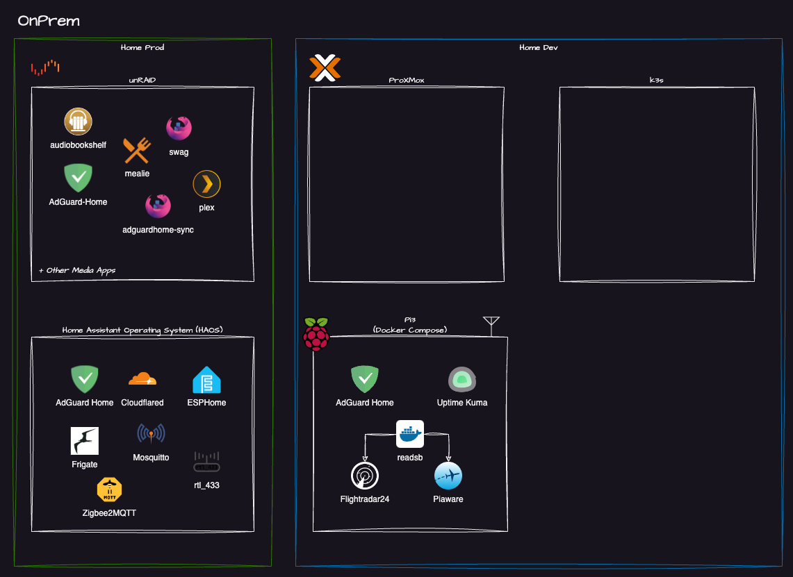

In this post, I want to share my plans for my homelab in 2025. I have been using a homelab for a few years now, and I have learned a lot along the way. I want to share my plans for 2025 and some of the lessons I have learned.

<!-- truncate -->

## What is a homelab?

A homelab is a personal computing environment that you can use to learn, experiment, and develop new skills. It can be as simple as a single computer or as complex as a network of servers and devices. A homelab can be used for a variety of purposes and theres whole communities around it. take a look at the [homelab subreddit](https://www.reddit.com/r/homelab/) for example.

## Environments

As is often the case with Homelab environments I have a family that consumes some of the services provided by the homelab. Given this we can think of the lab as two environments:

- **Home Production** This is any service anyone other than me uses. This includes things like the Plex, DNS etc.
The guiding principle here is KISS (Keep It Simple Stupid)

- **Home Lab** This is stuff only I care about.
The guiding principle here is to try out new things and learn,

## Clouds

Given its a **Home**lab the first 'cloud' we have is **OnPrem**, but as you may have noticed from the other posts on this blog I also have an Azure tenancy that will form part of this Homelab

## Platforms
I'm defining a platform as a system that hosts workloads, In my mind we have `Clouds - Platforms - Workloads`

## Workloads
There are too many workloads to list here, but I will try to give a few examples of the types of workloads I run in my homelab.

## Goals 

> The icons from this are from the awesome 