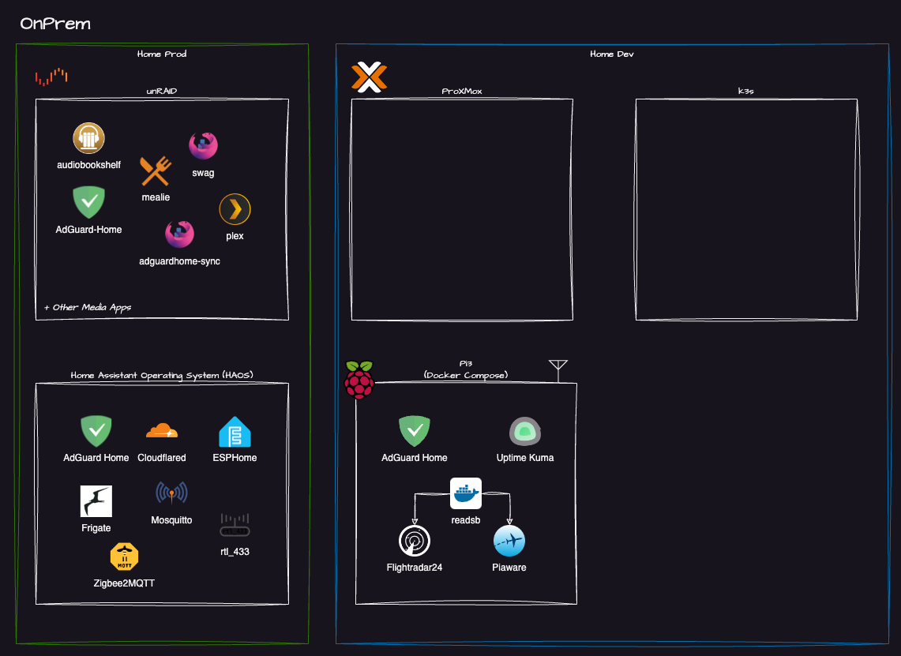

In this post, I’m sharing my plans for my homelab in 2025. I’ve been running a homelab in some form for years now. It’s been a great way to learn, experiment, and stay hands-on with new technologies. As we head into 2025, I’m taking a fresh look at my setup with some clear goals in mind. Here's what I’m aiming to build, explore, and improve in the coming year.

<!-- truncate -->

## What is a homelab?

A homelab is a personal computing environment that you can use to learn, experiment, and develop new skills. It can be as simple as a single computer or as complex as a network of servers and devices. A homelab can be used for a variety of purposes and there are whole communities dedicated to the hobby. Take a look at the [homelab subreddit](https://www.reddit.com/r/homelab/) for example.

## Why do I have a homelab?

For me, learning by doing is most effective, making my homelab an ideal environment to experiment with new technologies and acquire new skills. I also use my homelab to run a few services that I use in my day to day life.

By deploying and running actual workloads it allows me to gain an understanding and experience not as easily achieved by reading documentation or watching videos. 

My DevOps career largely started thanks to tinkering with Home Assistant and unRAID, this introduced me to yml and Docker and it just snowballed from there.

## My homelab

I've recently refactored my homelab repo and cleared up some hardware for some new projects, things are sparse for now, but it marks the beginning of a new era

### Environments

As is often the case with homelab environments I have a family that consumes some of the services provided by the homelab. In order to minimise the number of times I have to explain why Plex or DNS is not working, I have split my homelab into two environments.

- **Home Production** This is any service anyone other than me uses. This includes things like the Plex, DNS etc.
The guiding principle here is KISS (Keep It Simple Stupid)
- **Home Lab** This is stuff only I care about.
The guiding principle here is deploy things that encourage me to learn and experiment with new technologies while also providing a semi useful service.

### Clouds

My homelab is deployed across two clouds OnPrem (obviously it's a **Home**lab after all!) and Azure (given its my day job to work with Azure)

### Platforms
I define a platform as anything that can host one or more workloads and lives on a specific cloud. `cloud → platform → workload` 

:::note
Cloud Native workloads obviously skip this layer and run directly on cloud Services
:::

I have a few platforms OnPrem
- **unRAID** This is my main NAS and hosts a number of "Home Prod" workloads 
- **Home Assistant OS** This hosts Home Assistant and a number of other Home Automation containers
- **rpi3b Docker** This is a small standalone Docker host that runs a few containers
- **ProxMox** I've just freed up this server and am planning to install a ProxMox cluster on it. This will be used to run a few workloads 
- **K3s** I've dedicated some Raspberry Pi's and started building a k3s cluster, stay tuned for more on this in the future

### Workloads
There are too many workloads to list here, but for more information on the Platforms and workloads I run check out the [homelab repository](https://github.com/thecomalley/homelab/tree/main)

## Design Guidelines
I try to follow a few design guidelines when building out my homelab. These are not hard and fast rules but more of a guiding principle / things to aim for.

- **Everything As Code**
  - *The big exception here is the Home Prod environment, in the name of KISS, there is a fair amount of ClickOps*
- **Open Source**
  - I've learnt heaps from the wider open source community & content creators, so I'd like to do my small part to contribute back to the community

## 2025 Plans

So what are we looking to achieve in 2025?

- [x] **Clear separation of Home and Lab environments**
  - This is mostly done now — we’ve got a clear path for a k3s and Proxmox cluster that has no **Home Production** workloads on it
- [ ] **Deploy new *lab* workloads into a Kubernetes cluster**
  - I've started tinkering with k3s and have a fair idea of how I want to build this out. There will likely be a few blog posts on this in the future
- [ ] **Enable GitOps via ArgoCD for Kubernetes**
    - I want to be able to deploy workloads into my lab via GitOps, this will allow me to easily deploy and destroy workloads as required
- [ ] **Deploy a Hybrid Windows Server Lab**
  - I sometimes need to dive back into Windows Server and AD for work, so having a lab that I can boot up as required is useful
  - I'll split this Windows Server environment across Azure and OnPrem to replicate a real world scenario
- [ ] **Deploy a Self-hosted Pipeline agent to allow GitOps OnPrem**
  - I've already got a few Terraform and Ansible projects that are run locally from my laptop within the homelab repo, so getting a pipeline agent up and running would let me transition these into a more automated GitOps workflow 
- [ ] **Deploy High Availability ProxMox & K3s cluster**
  - This one is dependent on some new hardware, but ideally i'd like to get a 3 node ProxMox cluster up and running with a 3 node k3s cluster on top of it. This will allow me to run workloads in a more production like environment

## Wrapping Up
This homelab roadmap will probably evolve over time—as all good plans do—but it gives me a solid foundation for 2025. I’ll continue updating my [homelab repository](https://github.com/thecomalley/homelab) as I go, and might post updates here as well. If you’re working on your own homelab or have questions, feel free to reach out or share what you’re building too.

