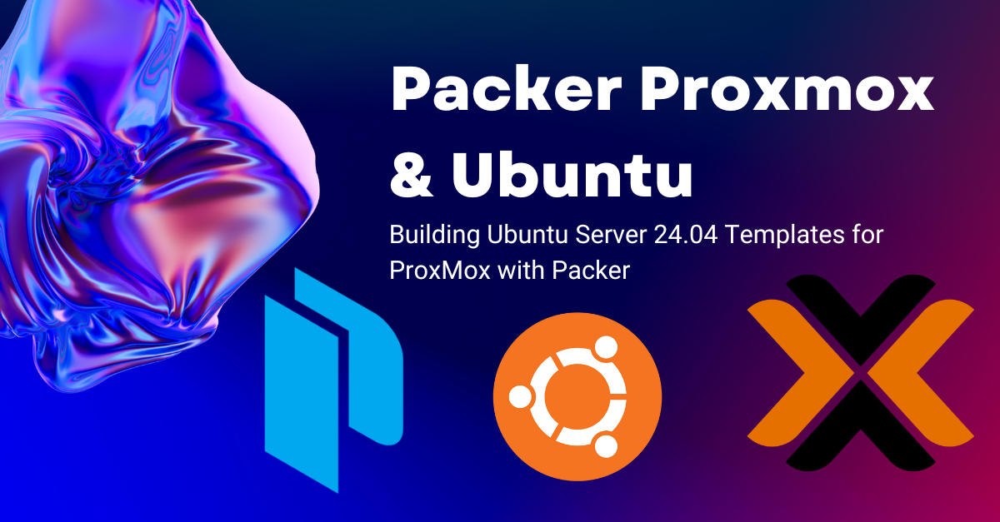
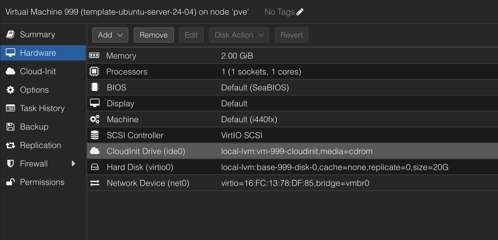
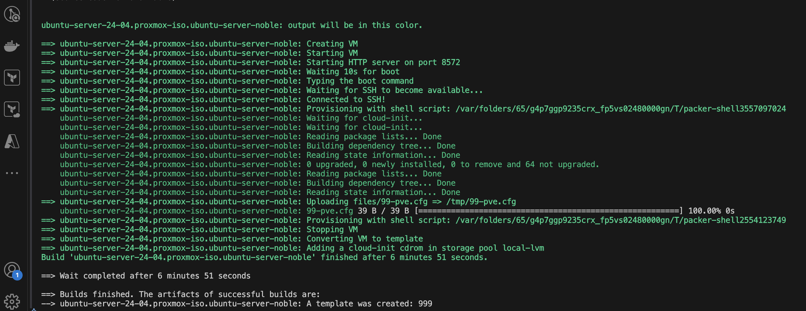

# 🏗️ Building Ubuntu Server 24.04 Templates for Proxmox with Packer



## 🚀 Introduction

I'm planning on setting up a k3s cluster and Windows Server lab in my homelab, which means I need to provision quite a few VMs. Clicking through installers definitely isn't very "as code" 😅, so I've turned to Packer to build VM templates with the idea that i can deploy these templates using Terraform and have them configured via Ansible.

Now Ubuntu offers [Ubuntu Cloud Images](https://cloud-images.ubuntu.com/) which can easily converted into [Cloud-Init Templates](https://pve.proxmox.com/wiki/Cloud-Init_Support) for use with Proxmox. But but since I'll need custom images for Windows anyway I figured I'd build my own Ubuntu templates too. Its a good opportunity to learn how to use Packer and Proxmox together, and I can customize the templates to my liking.

<!-- truncate -->

:::info
Packer is part of the HashiCorp suite of tools designed for modern infrastructure automation. It complements other IaC tools like Terraform and Ansible in a comprehensive code-based infrastructure ecosystem.
:::

## 🎯 My Requirements for VM Templates

I have two simple requirements for my VM templates:

1. **Proxmox Cloud-Init Support** - Templates must work seamlessly with Proxmox's cloud-init implementation, allowing me to set usernames and SSH keys either via the GUI or Terraform, Ubuntu 18.04 and later supports cloud-init natively, so we don't need to do anything special here, other than ensuring the VM template contains a CD-ROM drive, which will be used to pass the Cloud-Init data to the VM in ProxMox

2. **QEMU Guest Agent** - Pre-installed QEMU guest agent for better VM management and monitoring. This is important for things like live migration, shutdown, and snapshotting. The QEMU guest agent is a daemon that runs inside the VM and communicates with the Proxmox host, providing information about the VM's state and allowing for better integration with the hypervisor.

## Cloud Init

Cloud-init is the industry standard method for cross-platform cloud instance initialization. It is supported across all major public cloud providers, provisioning systems for private cloud infrastructure, and bare-metal installations.

During boot, cloud-init identifies the cloud it is running on and initializes the system accordingly. Cloud instances will automatically be provisioned during first boot with networking, storage, SSH keys, packages and various other system aspects already configured.

Proxmox uses the `NoCloud` datasource to provide cloud-init with the necessary configuration data. The VM needs to have attached as ISO images via a virtual CDROM drive. 

:::info
The [Cloud Init datasource documentation](https://cloudinit.readthedocs.io/en/latest/reference/datasources.html#datasources-supported) is an interesting read for learning how other cloud providers pass configuration to the Virtual Machines.
:::

## 🔐 Security and Authentication

We need to authenticate with the Proxmox API to create and manage VMs. The recommended way to do this is by using an API token, which can be created in the Proxmox web interface.

:::danger Security Best Practice
Never commit credentials or sensitive tokens to your git repository! Always use environment variables or secure vaults for authentication information.
:::

1. Authentication credentials are stored in environment variables:
   ```sh
   PROXMOX_URL="https://<server>:<port>/api2/json"
   PROXMOX_USERNAME="root"
   PROXMOX_TOKEN="<token>"
   ```

2. Configuration variables are in a `.auto.pkrvars.hcl` file (excluded from git):
   ```hcl
   proxmox_node = "pve"
   ssh_username = "superadmin"
   ssh_authorized_keys = ["ssh-rsa AAAAB3Nz..."]
   ```

## 🛠️ The Installation Process

The Packer process follows these steps:

1. **Start VM**: Boots a VM with the Ubuntu Server 24.04 ISO
2. **Autoinstall**: Uses the boot command to trigger Ubuntu's autoinstall
3. **Cloud-Init**: Configures the system using cloud-init
4. **Provisioning**: Runs shell provisioners to clean up and prepare the VM
5. **Template Creation**: Converts the VM to a template


## 🗂️ Repository Structure

My Packer template for Ubuntu Server 24.04 is organized as follows:

```
ubuntu-server-24-04/
├── README.md
├── ubuntu-server-24-04.pkr.hcl
├── variables.pkr.hcl
├── my.auto.pkrvars.hcl (excluded from git)
└── files/
    ├── 99-pve.cfg
    ├── meta-data
    └── user-data.pkrtpl.hcl
```

### 🔧 Variables (variables.pkr.hcl)

The variables file defines what parameters can be customized:

- `proxmox_node`: The Proxmox node to build on
- `vm_id`: VM ID for the template
- `vm_name`: VM name for the template
- `ssh_username`: Username for SSH connections
- `ssh_authorized_keys`: SSH public keys for the user


### 📄 1. Boot a VM with the Ubuntu Server 24.04 ISO

The main Packer configuration file (`ubuntu-server-24-04.pkr.hcl`) defines the VM template and its settings. It uses the `proxmox-iso` builder to create a VM from an ISO image.

```hcl
packer {
  required_plugins {
    proxmox = {
      version = "~> 1.0"
      source  = "github.com/hashicorp/proxmox"
    }
  }
}

# Resource Definition for the VM Template
source "proxmox-iso" "ubuntu-server-noble" {

  insecure_skip_tls_verify = true
  node                     = var.proxmox_node

  # VM General Settings
  vm_id   = "800"
  vm_name = "ubuntu-server-noble"

  template_name        = "template-ubuntu-server-24-04"
  template_description = "Created by Packer on ${timestamp()}"

  # VM OS Settings
  boot_iso {
    type             = "scsi"
    iso_path         = "local:iso/ubuntu-24.04.2-live-server-amd64.iso"
    iso_storage_pool = "local"
    unmount          = true
  }

  # VM System Settings
  qemu_agent = true

  # VM Hard Disk Settings
  scsi_controller = "virtio-scsi-pci"

  disks {
    disk_size    = "20G"
    format       = "raw"
    storage_pool = "local-lvm"
    type         = "virtio"
  }

  # VM CPU Settings
  cores = "1"

  # VM Memory Settings
  memory = "2048"

  # VM Network Settings
  network_adapters {
    model    = "virtio"
    bridge   = "vmbr0"
    firewall = "false"
  }

  # VM Cloud-Init Settings
  cloud_init              = true
  cloud_init_storage_pool = "local-lvm"

...
}
```

### 🖥️ Boot command to trigger Ubuntu's autoinstall

This sequence escapes the GRUB menu, modifies the boot parameters to use the autoinstall feature, and points it to the HTTP server that Packer spins up containing our cloud-init configuration.

```hcl
  # The time to wait after booting the initial virtual machine before typing the boot_command
  boot_wait = "10s"

  # Escape the GUI installer and use the autoinstall method
  boot_command = [
    "<esc><wait>",
    "e<wait>",
    "<down><down><down><end>",
    "<bs><bs><bs><bs><wait>",
    "autoinstall ds=nocloud-net\\;s=http://{{ .HTTPIP }}:{{ .HTTPPort }}/ ---<wait>",
    "<f10><wait>"
  ]
```

### ☁️ Cloud-Init Configuration

Packer also uses cloud-init to configure the VM during the build process. again using the `NoCloud` datasource. but instead of passing the configuration via an ISO image, it uses a local HTTP server to serve the configuration files. This allows Packer to pass the necessary configuration data to the VM during the build process. we configure this with the command `autoinstall ds=nocloud-net\\;s=http://{{ .HTTPIP }}:{{ .HTTPPort }}/ ---<wait>`. in the `boot_command` section above.

```hcl
locals {
  user_data = templatefile("${path.root}/files/user-data.pkrtpl.hcl", {
    ssh_username        = var.ssh_username
    ssh_authorized_keys = join("\n", var.ssh_authorized_keys)
  })
}

  ...

  # Provide content to the autoinstall Server
  http_content = {
    "/user-data" = local.user_data
    "/meta-data" = file("${path.root}/files/meta-data")
  }

  communicator         = "ssh"
  ssh_username         = var.ssh_username
  ssh_private_key_file = "~/.ssh/id_rsa"

  # Raise the timeout, when installation takes longer
  ssh_timeout = "30m"
  ssh_pty     = true
```

:::note
The `templatefile` function allows us to use variables within our cloud-init configuration, making the template much more flexible.
:::

The VM template settings are configured with detailed specifications for disk, CPU, memory, networking, and more.

### ☁️ Cloud-Init Configuration (user-data.pkrtpl.hcl)

The cloud-init configuration uses HCL templating to inject variables at build time. This is where we implement several of our key requirements:

```hcl
#cloud-config
autoinstall:
  version: 1
  locale: en_NZ
  keyboard:
    layout: us
  ssh:
    install-server: true
    allow-pw: true
    disable_root: true
    ssh_quiet_keygen: true
    allow_public_ssh_keys: true
  packages:
    - qemu-guest-agent  # Pre-installing QEMU guest agent
  # More configuration...
  user-data:
    package_upgrade: false
    timezone: Pacific/Auckland  # Setting timezone
    users:
      - name: ${ssh_username}
        groups: [adm, sudo]
        sudo: ALL=(ALL) NOPASSWD:ALL
        shell: /bin/bash
        ssh_authorized_keys:  # Pre-installing SSH keys
          - ${ssh_authorized_keys}
```

:::success Meeting Requirements
This configuration takes care of three of our four key requirements: SSH keys, QEMU guest agent, and timezone. The 99-pve.cfg file (shown later) handles the Proxmox cloud-init integration.
:::

## 🧹 Preparing the Template

After the installation, several cleanup steps prepare the VM for templating:

```hcl
provisioner "shell" {
  inline = [
    "while [ ! -f /var/lib/cloud/instance/boot-finished ]; do echo 'Waiting for cloud-init...'; sleep 1; done",
    "sudo rm /etc/ssh/ssh_host_*",
    "sudo truncate -s 0 /etc/machine-id",
    "sudo apt -y autoremove --purge",
    "sudo apt -y clean",
    "sudo apt -y autoclean",
    "sudo cloud-init clean",
    "sudo rm -f /etc/cloud/cloud.cfg.d/subiquity-disable-cloudinit-networking.cfg",
    "sudo rm -f /etc/netplan/00-installer-config.yaml",
    "sudo sync"
  ]
}
```

:::tip
These cleanup steps are crucial for ensuring that each VM created from this template will have unique identifiers and configurations. Without them, you might encounter networking or SSH issues when deploying multiple VMs.
:::

### ☁️ Overriding Cloud-Init datasource

Now the OS already has cloud-init installed, but since we are only ever going to run this template on Proxmox we can override the default datasource discovery 

```hcl
provisioner "file" {
  source      = "files/99-pve.cfg"
  destination = "/tmp/99-pve.cfg"
}

provisioner "shell" {
  inline = ["sudo cp /tmp/99-pve.cfg /etc/cloud/cloud.cfg.d/99-pve.cfg"]
}
```

The `99-pve.cfg` file contains:
```
datasource_list: [ConfigDrive, NoCloud]
```

:::info Critical Configuration
This configuration is what makes the template compatible with Proxmox's cloud-init implementation. It ensures that cloud-init looks for configuration from the right sources when deployed as a VM in Proxmox, allowing you to set usernames and SSH keys via the GUI or Terraform.
:::



## 🚀 Running the Build

To build the template:

1. Set the environment variables for authentication
2. Create your variables file with the necessary configuration
3. Run Packer:
   ```bash
   packer init .
   packer build .
   ```

:::info
The `packer init` command is important as it downloads and installs the required plugins specified in your configuration.
:::



## 🧩 Integration with the Automation Pipeline

With our template created, we can now use Use Terraform to Deploy VMs & run Ansible Playbooks Immediately but more on that another day.

## 🏁 Conclusion

Using Packer with Proxmox creates VM templates that perfectly fit into an infrastructure-as-code workflow. By ensuring our templates meet our key requirements - Proxmox cloud-init integration, pre-installed SSH keys, QEMU guest agent, and basic system configuration - we enable a completely automated, code-driven infrastructure.


---

*Shout out to Christian Lempa for his tutorial on Packer and Proxmox: https://www.youtube.com/watch?v=1nf3WOEFq1Y*