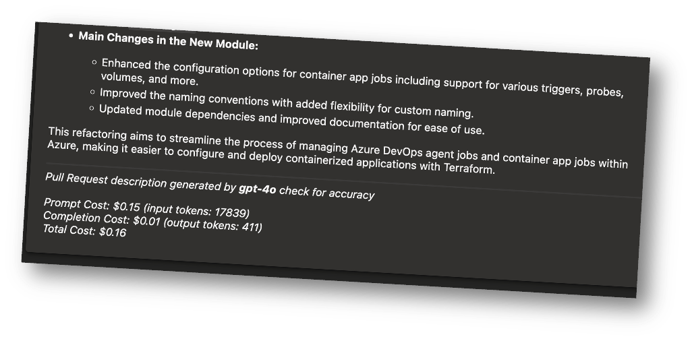

GitHub Copilot has an impressive [feature](https://docs.github.com/en/enterprise-cloud@latest/copilot/using-github-copilot/creating-a-pull-request-summary-with-github-copilot) that automatically generates pull request descriptions based on the changes made in a branch. However i wanted to use this functionality in Azure DevOps, so using Azure OpenAI i threw together a quick bot that automates the process of generating PR descriptions in Azure DevOps using OpenAI's GPT-4o model.

## The Problem: Manual PR Descriptions

Writing clear and concise PR descriptions can be a time-consuming task. Developers often need to summarize changes made in a feature branch, highlight key modifications, and provide context, which can easily be overlooked in fast-paced environments. While GitHub Copilot provides a useful feature for generating PR descriptions automatically.

The bot works by:

- Fetching the diff between the source and target branches.
- Passing the diff along with a system message to OpenAI.
- Tracking the cost of the OpenAI model usage, for proof of value.
- Automatically updating the PR description in Azure DevOps.

### Fetching the diff between the source and target branches
Here we define a function to get the diff between the source and target branches using the `git diff` command. This forms the bulk of the input we provide to the OpenAI model.

```python
def get_diff(source_branch, target_branch):
  """
  Get the diff between the source and target branches.

  Parameters:
  source_branch (str): The name of the source branch.
  target_branch (str): The name of the target branch.

  Returns:
  tuple: The diff summary and the full diff.

  Raises:
  Exception: If there was an error getting the diff.
  """
  logging.info(f"Getting diff between {source_branch} and {target_branch}")
  try:
    diff_summary = subprocess.check_output(["git", "diff", "--compact-summary", target_branch, source_branch]).decode("utf-8")
    diff = subprocess.check_output(["git", "diff", target_branch, source_branch]).decode("utf-8")
  except Exception as e:
    logging.error(f"Failed to get diff: {e}")
    raise
  else:
    return diff_summary, diff


# Calling the function
diff_summary, diff = get_diff(
    source_branch=os.getenv("DESCRIPTOBOT_SOURCE_BRANCH"),
    target_branch=os.getenv("DESCRIPTOBOT_TARGET_BRANCH")
)
```

### Passing the diff along with a system message to OpenAI.
Here we use the Python SDK for OpenAI, the `AzureOpenAI` which is nearly identical to the `OpenAI` SDK.

Next we craft a system message that explains the task to the bot, and then pass the system message, diff summary, and full diff to the OpenAI model.

```python
from openai import AzureOpenAI

client = AzureOpenAI(
  azure_endpoint=os.getenv("AZURE_OPENAI_ENDPOINT"),
  api_key=os.getenv("AZURE_OPENAI_API_KEY"),
  api_version="2024-02-01"
)

system_message = f"""
You are a bot that will help create an Azure DevOps Pull Request description based on a git diff summary and full diff.
Include a Summary and Key Changes section only
Suggest a PR title based on the changes using an gitmoji prefix this should be the first line of the PR description, don't prefix with # or ##.
There is a character limit of 4000 characters for the PR description so keep it below that.
"""

response = client.chat.completions.create(
    model="gpt-4o", # model = "deployment_name".
    messages=[
        {"role": "system", "content": system_message},
        {"role": "user", "content": "Create a Pull Request description based on the git diff."},
        {"role": "user", "content": diff_summary},
        {"role": "user", "content": diff}
    ]
)
```

### Tracking the cost of the OpenAI model usage, for proof of value.
The other thing i wanted to do was expose the cost of using the OpenAI model to the user. This is important for tracking the cost of the bot and ensuring that it is providing value.

The OpenAI billing uses two main measures for cost, input tokens and output tokens. The input tokens are the tokens used to generate the response, while the output tokens are the tokens in the response. The cost is calculated based on the number of tokens used.

The SDK response will provide both the input and output tokens, which we can use to calculate the cost.

```python
model_info = {
    "gpt-4o": {
        "name": "gpt-4o",
        "input_tokens": 128000,
        "output_tokens": 4096,
        "input_cost": 0.0000082,
        "output_cost": 0.0000245,
    },
}

prompt_cost = response.usage.prompt_tokens * model["input_cost"]
completion_cost = response.usage.completion_tokens * model["output_cost"]
total_cost = prompt_cost + completion_cost
```

### Automatically updating the PR description in Azure DevOps

Here we just use the Azure DevOps REST API to update the PR description with the generated content.
I won't go into the details of the API call, but you can find the documentation [here](https://learn.microsoft.com/en-us/rest/api/azure/devops/git/pull-requests/update?view=azure-devops-rest-7.1).

I've asked the model to suggest a PR title based on the changes, so we extract the first line of the PR description and use it as the PR title. We then add a footer to the PR description that includes the cost of using the OpenAI model.


```python
footer = f"""

---
_Pull Request description generated by **{model['name']}** check for accuracy_

_Prompt Cost: ${prompt_cost:.2f} (input tokens: {response.usage.prompt_tokens})
Completion Cost: ${completion_cost:.2f} (output tokens: {response.usage.completion_tokens})
Total Cost: ${total_cost:.2f}_
"""

# build the final PR description
# extract the first line of the PR description
pr_title = response.choices[0].message.content.split("\n")[0]
print(pr_title)

# Remove the first line from the PR description & add the footer
pr_description = "\n".join(response.choices[0].message.content.split("\n")[1:]) + footer
print(pr_description)

# Call the function to update the PR description
update_pr_description(pr_number, pr_description, pr_title)
```

### Example PR Description
Here's part of an example PR description generated by the bot:

